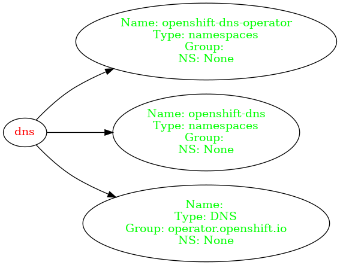

# corg

`corg` is a Cluster Operator Relationship Graph tool to use with OpenShift 4.x. It accepts a list of Cluster Operators (e.g. `oc get clusteroperators -o json`) and generates a graph for the relatedObjects fields.

It is useful for newcomers to OpenShift 4 trying to understand how components (Cluster Operators and Resources) are interconnected.

Here's an example of a small graph generated by `corg`:

